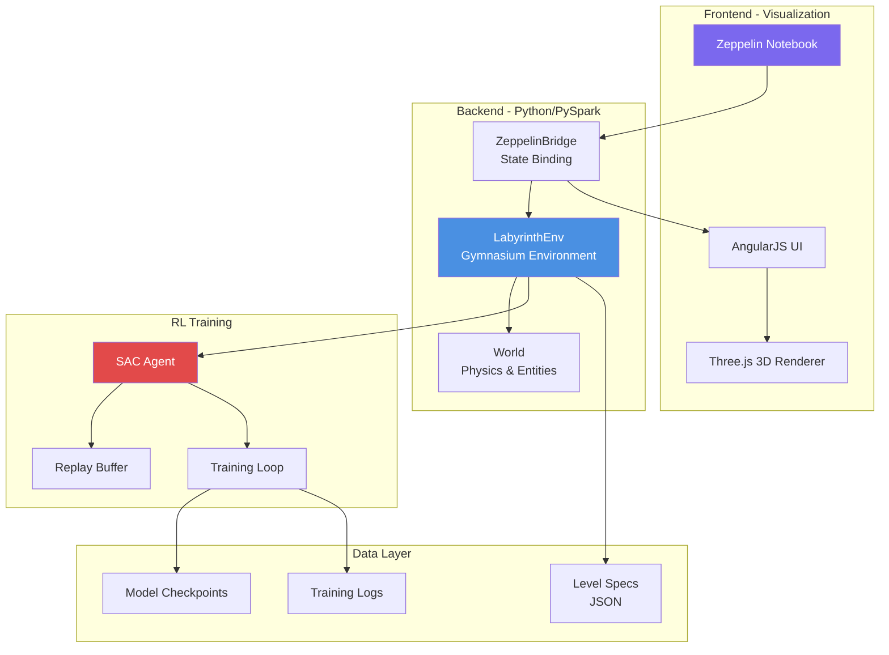
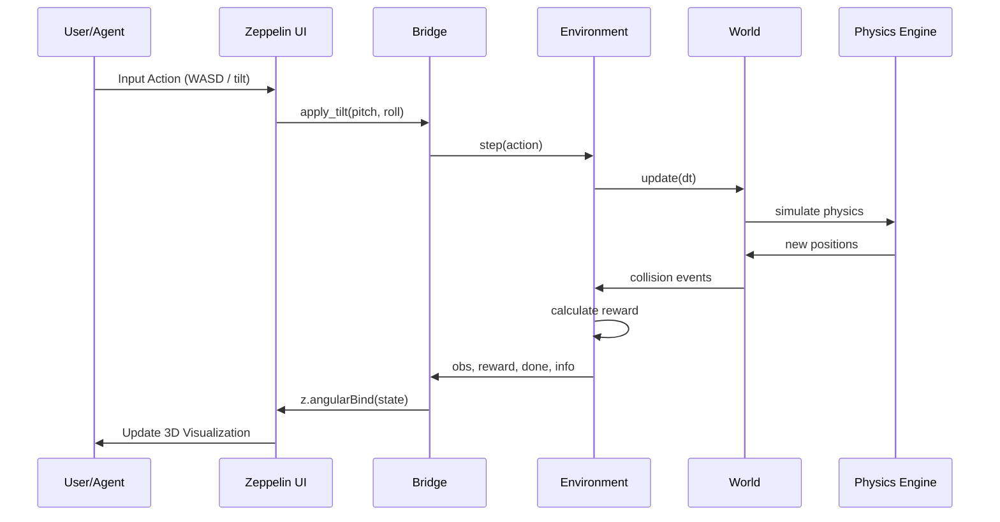
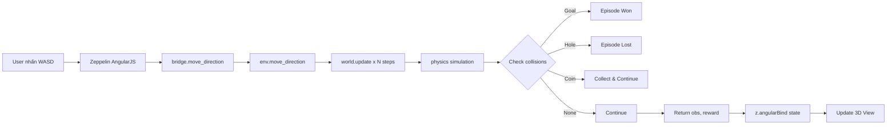
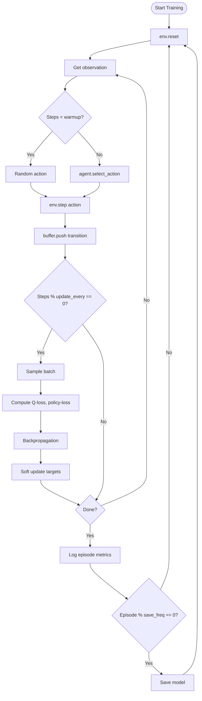
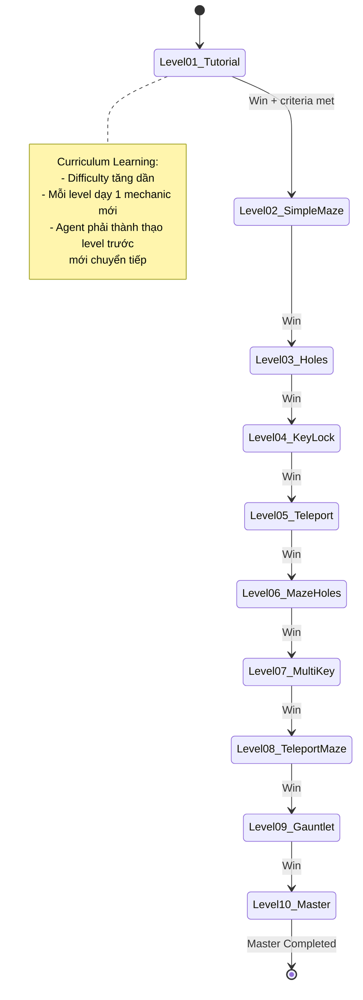
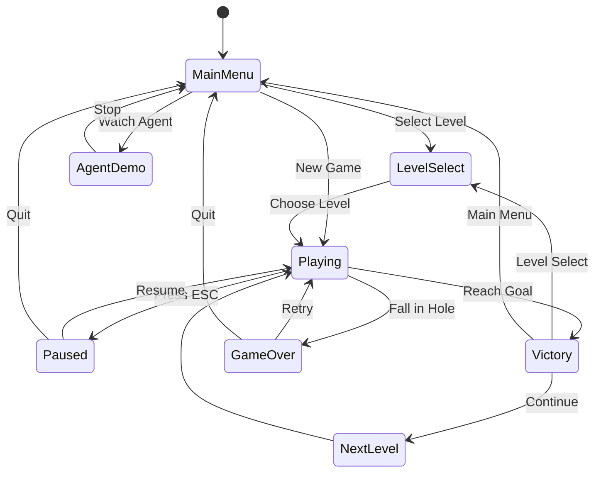

# Labyrinth RL - Tài Liệu Chi Tiết Dự Án

<div align="center">

**Multi-Floor 3D Maze Environment + Deep Reinforcement Learning**

*Từ Q-Learning đến SAC/PPO - A Complete RL Journey*

</div>

---

## 📋 Mục Lục

1. [Tổng Quan Dự Án](#1-tổng-quan-dự-án)
2. [Kiến Trúc Hệ Thống](#2-kiến-trúc-hệ-thống)
3. [Cấu Trúc Thư Mục](#3-cấu-trúc-thư-mục)
4. [Flow Hoạt Động](#4-flow-hoạt-động)
5. [MDP Formulation](#5-mdp-formulation)
6. [Components Chi Tiết](#6-components-chi-tiết)
7. [Level Design System](#7-level-design-system)
8. [Roadmap Phát Triển](#8-roadmap-phát-triển)
9. [Hướng Dẫn Sử Dụng](#9-hướng-dẫn-sử-dụng)

---

## 1. Tổng Quan Dự Án

### 1.1 Giới Thiệu

**Labyrinth RL** là một dự án học tập và nghiên cứu về Reinforcement Learning, được xây dựng theo phong cách của hai cuốn sách kinh điển:

- **"Reinforcement Learning: An Introduction" (Sutton & Barto)** - Nền tảng lý thuyết MDP, Bellman Equations, Tabular Methods
- **"Deep Reinforcement Learning Hands-On" (Maxim Lapan)** - Triển khai thực tế với PyTorch, Deep RL algorithms

### 1.2 Mục Tiêu Dự Án

| Mục Tiêu | Mô Tả |
|----------|-------|
| **Học thuật** | Hiểu sâu về RL từ cơ bản đến nâng cao |
| **Thực hành** | Triển khai các thuật toán RL state-of-the-art |
| **Tích hợp** | Kết hợp game engine với RL training pipeline |
| **Curriculum Learning** | Hệ thống levels từ dễ đến khó cho agent học |

### 1.3 Technology Stack

```
Backend:        Python 3.8+, PyTorch 2.0+, Gymnasium (OpenAI Gym)
Environment:    Custom Gym Environment (2D Physics)
Visualization:  Apache Zeppelin + AngularJS + Three.js
Training:       SAC (Soft Actor-Critic), TD3 (future), PPO (future)
Infrastructure: Docker + Docker Compose
```

---

## 2. Kiến Trúc Hệ Thống

### 2.1 Sơ Đồ Tổng Quan



### 2.2 Luồng Dữ Liệu (Data Flow)



### 2.3 Design Patterns

| Pattern | Ứng Dụng | Vị Trí |
|---------|----------|--------|
| **Entity-Component** | Quản lý game objects (Ball, Wall, Coin, etc.) | `src/labyrinth_env/core/entity.py` |
| **Strategy** | Đổi policy/reward dễ dàng | `src/rl/agents/base.py` |
| **State Machine** | Game states (Playing, Won, Lost) | `src/labyrinth_env/core/state_machine.py` |
| **Observer (Pub-Sub)** | Event system cho binding | `src/labyrinth_env/core/events.py` |
| **Factory + Registry** | Tạo entities từ level spec | `src/labyrinth_env/entities/builders.py` |
| **Command** | Input handling | `src/labyrinth_env/core/commands.py` |
| **Bridge** | Kết nối backend-frontend | `src/labyrinth_env/bridge.py` |

---

## 3. Cấu Trúc Thư Mục

```
Labyrinth_RL/
├── 📂 src/                          # Source code chính
│   ├── 📂 labyrinth_env/            # Game environment
│   │   ├── 📂 core/                 # Core systems
│   │   │   ├── entity.py           # Base Entity class
│   │   │   ├── world.py            # World (chứa entities)
│   │   │   ├── components.py       # Position, Physics, Renderable
│   │   │   ├── events.py           # EventBus, GameEvent
│   │   │   ├── state_machine.py    # Game state management
│   │   │   └── commands.py         # Input commands
│   │   ├── 📂 entities/            # Game objects
│   │   │   └── builders.py         # Entity factories
│   │   ├── env.py                  # LabyrinthEnv (Gym API)
│   │   ├── level_spec.py           # Level loader & registry
│   │   └── bridge.py               # Zeppelin binding
│   └── 📂 rl/                       # Reinforcement Learning
│       ├── 📂 agents/              
│       │   ├── base.py             # PolicyStrategy interface
│       │   └── sac.py              # SAC Agent implementation
│       ├── buffer.py               # Replay Buffer
│       └── train.py                # Training loop utilities
├── 📂 notebooks/                    # Zeppelin notebooks
│   ├── 01_Labyrinth_Game_*.zpln    # Main game notebook
│   ├── 01_labyrinth_game.json      # JSON export
│   └── 02_train_sac.json           # SAC training notebook
├── 📂 data/
│   ├── 📂 levels/                  # Level definitions (JSON)
│   │   ├── level_01_tutorial.json
│   │   ├── level_02_simple_maze.json
│   │   ├── ...
│   │   └── level_10_master.json
│   ├── 📂 models/                  # Trained checkpoints (.pth)
│   └── 📂 logs/                    # Training logs
├── 📂 assets/                       # Frontend resources
├── Dockerfile                       # Zeppelin container
├── docker-compose.yml
├── requirements.txt
└── README.md
```

### 3.1 Giải Thích Các Module Chính

#### **`src/labyrinth_env/`** - Game Environment

- **Core Systems** (`core/`):
  - `entity.py`: Base class cho tất cả game objects
  - `world.py`: Container chứa entities, quản lý physics loop
  - `events.py`: EventBus để publish/subscribe events (coin collected, goal reached, etc.)
  - `state_machine.py`: State machine cho game flow (Playing → Won/Lost)
  
- **Environment** (`env.py`):
  - Conform Gymnasium API: `reset()`, `step()`, `render()`, `close()`
  - Observation space: ball position, velocity, tilt angles, distances
  - Action space: continuous `[pitch, roll]` hoặc discrete 8-direction
  - Reward shaping: goal, coin, hole penalty, time penalty

- **Bridge** (`bridge.py`):
  - Kết nối Python backend với AngularJS frontend
  - Sử dụng `z.angularBind()` để sync state
  - Event handlers tự động update UI khi có thay đổi

#### **`src/rl/`** - RL Algorithms

- **Agents**:
  - `base.py`: Interface `PolicyStrategy` cho tất cả agents
  - `sac.py`: **Soft Actor-Critic** (Haarnoja et al., 2018)
    - Twin Q-Networks (giảm overestimation)
    - Automatic entropy tuning
    - Continuous action space
  
- **Buffer** (`buffer.py`):
  - Replay Buffer với prioritized sampling (optional)
  - Efficient numpy-based storage

---

## 4. Flow Hoạt Động

### 4.1 Human Play Flow



### 4.2 RL Training Flow



### 4.3 Level Progression Flow



---

## 5. MDP Formulation

### 5.1 Định Nghĩa MDP

Theo **Sutton & Barto Chapter 3**, Labyrinth environment là một **finite-horizon MDP**:

$$
\mathcal{M} = \langle \mathcal{S}, \mathcal{A}, \mathcal{P}, \mathcal{R}, \gamma, T \rangle
$$

| Ký Hiệu | Tên | Mô Tả |
|---------|-----|-------|
| $\mathcal{S}$ | State Space | Continuous (position, velocity, tilt, distances) |
| $\mathcal{A}$ | Action Space | Continuous $[-1, 1]^2$ hoặc Discrete $\{0,…,8\}$ |
| $\mathcal{P}$ | Transition Dynamics | Deterministic physics (có thể thêm noise) |
| $\mathcal{R}$ | Reward Function | Shaped reward (goal + coin - hole - time) |
| $\gamma$ | Discount Factor | 0.99 (default) |
| $T$ | Max Horizon | 3000 steps (configurable) |

### 5.2 State Space $\mathcal{S}$

**Observation vector** (dimension = 2 + 2 + 2 + N):

```python
obs = [
    ball.x,         # Ball position X
    ball.y,         # Ball position Y
    ball.vx,        # Ball velocity X (optional)
    ball.vy,        # Ball velocity Y (optional)
    tilt.pitch,     # Board tilt pitch (optional)
    tilt.roll,      # Board tilt roll (optional)
    # Distances to objects (optional, N varies)
    dist_to_goal,
    dist_to_nearest_hole,
    dist_to_nearest_coin,
    ...
]
```

**Normalization**: Tất cả values được normalize về $[-1, 1]$ hoặc $[0, 1]$ để giúp neural network học tốt hơn.

### 5.3 Action Space $\mathcal{A}$

#### Mode 1: Continuous (cho SAC/TD3)

$$
a_t = [\text{pitch}, \text{roll}] \in [-1, 1]^2
$$

- Được scale lên thành góc nghiêng thực tế: $[-0.15, 0.15]$ radians

#### Mode 2: Discrete 8-Direction (cho DQN)

$$
a_t \in \{0, 1, 2, …, 8\}
$$

```
0 = none      1 = up        2 = upright
3 = right     4 = downright 5 = down
6 = downleft  7 = left      8 = upleft
```

### 5.4 Reward Function $\mathcal{R}$

**Composite reward** (theo Sutton & Barto Chapter 6 - Shaping Functions):

$$
r_t = r_{\text{goal}} + r_{\text{coin}} + r_{\text{hole}} + r_{\text{time}} + r_{\text{distance}}
$$

| Component | Value | Điều Kiện |
|-----------|-------|-----------|
| $r_{\text{goal}}$ | +1000 | Ball chạm goal |
| $r_{\text{coin}}$ | +100 × scale | Ball thu coin |
| $r_{\text{hole}}$ | -100 | Ball rơi vào hole |
| $r_{\text{time}}$ | -0.1 | Mỗi step (encourage speed) |
| $r_{\text{distance}}$ | $\Delta d \times$ scale | Giảm khoảng cách đến goal (optional) |

**Reward Shaping**: Theo Ng et al. (1999), potential-based shaping không làm thay đổi optimal policy nếu tuân thủ:

$$
r'(s,a,s') = r(s,a,s') + \gamma \Phi(s') - \Phi(s)
$$

với $\Phi(s) = -\text{distance\_to\_goal}(s)$.

### 5.5 Bellman Optimality Equation

Mục tiêu training là tìm optimal Q-function (Sutton & Barto Chapter 4):

$$
Q^*(s,a) = \mathbb{E}\left[r + \gamma \max_{a'} Q^*(s', a')\right]
$$

SAC mở rộng với **maximum entropy objective** (Haarnoja et al., 2018):

$$
\pi^* = \arg\max_\pi \mathbb{E}_{\tau \sim \pi}\left[\sum_t r_t + \alpha \mathcal{H}(\pi(\cdot|s_t))\right]
$$

---

## 6. Components Chi Tiết

### 6.1 LabyrinthEnv (`src/labyrinth_env/env.py`)

**Class chính** conform Gymnasium API:

```python
class LabyrinthEnv:
    def __init__(self, config: EnvConfig = None, levels_dir: str = None)
    def reset(self, level_id: str = None, seed: int = None) -> Tuple[np.ndarray, Dict]
    def step(self, action: np.ndarray) -> Tuple[np.ndarray, float, bool, bool, Dict]
    def render(self, mode: str = 'state') -> Dict
    def close(self)
```

**Observation Space**:
```python
spaces.Box(low=-np.inf, high=np.inf, shape=(obs_dim,), dtype=np.float32)
```

**Action Space**:
```python
spaces.Box(low=-1.0, high=1.0, shape=(2,), dtype=np.float32)  # Continuous
# OR
spaces.Discrete(9)  # Discrete 8-dir
```

**Key Methods**:

- `move_direction(direction: str, num_steps: int)`: Di chuyển ball theo hướng với momentum (hybrid control)
- `step_discrete_8dir(action: int)`: Wrapper cho discrete actions
- `_calculate_reward(step_info)`: Tính composite reward
- `_get_observation()`: Build observation vector với normalization

### 6.2 World & Physics (`src/labyrinth_env/core/world.py`)

**World** là physics container:

```python
class World:
    def __init__(self, width: float, height: float, max_tilt: float = 0.15)
    def update(self, dt: float) -> Dict[str, Any]
    def add_entity(self, entity: Entity)
    def remove_entity(self, entity: Entity)
    def emit_event(self, event_type: GameEvent, data: Dict)
```

**Physics Loop** (trong `update()`):

1. Tính gravity force từ tilt: $F_g = mg \sin(\theta)$
2. Apply forces lên ball entities
3. Update velocities & positions
4. Check collisions (ball-wall, ball-hole, ball-coin, ball-goal)
5. Emit events cho collision handlers

### 6.3 SAC Agent (`src/rl/agents/sac.py`)

**Network Architecture**:

```python
# Actor: Gaussian Policy
state → MLP(256, 256) → [mean, log_std] → Normal(μ, σ) → action

# Twin Critics: Q1, Q2
[state, action] → MLP(256, 256) → Q-value
```

**Update Rules** (theo paper Haarnoja et al., 2018):

**Critic Update**:
$$
L_Q = \mathbb{E}\left[(Q(s,a) - (r + \gamma \min_{i=1,2} Q_{\text{target}}(s', a') - \alpha \log \pi(a'|s')))^2\right]
$$

**Actor Update**:
$$
L_\pi = \mathbb{E}\left[\alpha \log \pi(a|s) - Q(s,a)\right]
$$

**Temperature Update** (auto-tuning):
$$
L_\alpha = -\mathbb{E}\left[\alpha (\log \pi(a|s) + \mathcal{H}_{\text{target}})\right]
$$

**Soft Target Update**:
$$
\theta_{\text{target}} \leftarrow \tau \theta + (1-\tau) \theta_{\text{target}}
$$

### 6.4 Zeppelin Bridge (`src/labyrinth_env/bridge.py`)

**Binding Workflow**:

```python
class ZeppelinBridge:
    def __init__(self, zeppelin_context, config):
        self.z = zeppelin_context  # Zeppelin notebook context
        self.env = LabyrinthEnv(config)
        
    def step(self, action):
        obs, reward, done, truncated, info = self.env.step(action)
        state = self.env.get_state()
        self._bind('gameState', state)  # Auto-update AngularJS
        return {'obs': obs, 'reward': reward, 'done': done, 'state': state}
    
    def _bind(self, name, value):
        self.z.angularBind(name, json.dumps(value, cls=NumpyEncoder))
```

**Event Handlers**:
- `_on_coin_collected`: Update score, trigger animation
- `_on_episode_ended`: Show victory/defeat screen
- `_on_state_updated`: Refresh 3D visualization

---

## 7. Level Design System

### 7.1 Level Spec Format (JSON)

```json
{
  "id": "level_01_tutorial",
  "name": "Tutorial",
  "difficulty": 1,
  "description": "Đưa bi vào lỗ. Dùng WASD để nghiêng bàn.",
  "hints": ["Nghiêng bàn sang phải để bi lăn về goal"],
  
  "board": {
    "width": 8.0,
    "height": 8.0,
    "max_tilt": 0.15
  },
  
  "ball": {
    "start": [-3.0, 0.0],
    "radius": 0.3
  },
  
  "goal": {
    "position": [3.0, 0.0],
    "radius": 0.6,
    "reward": 1000.0
  },
  
  "walls": [
    {"position": [0, -3], "size": [4.0, 0.5, 0.2]},
    {"position": [0, 3], "size": [4.0, 0.5, 0.2]}
  ],
  
  "holes": [],
  "coins": [],
  "keys": [],
  "locks": [],
  "teleports": [],
  
  "time_limit": 0,
  
  "rewards": {
    "goal": 1000.0,
    "hole_penalty": -100.0,
    "coin_value": 100,
    "time_penalty": -0.1
  }
}
```

### 7.2 Curriculum Levels

| Level | Name | Mechanics | Difficulty |
|-------|------|-----------|------------|
| 01 | Tutorial | Basic tilt movement | ★☆☆☆☆ |
| 02 | Simple Maze | Walls navigation | ★★☆☆☆ |
| 03 | Holes | Avoid traps | ★★☆☆☆ |
| 04 | Key & Lock | Unlock doors | ★★★☆☆ |
| 05 | Teleport | Portals | ★★★☆☆ |
| 06 | Maze + Holes | Combination | ★★★★☆ |
| 07 | Multi-Key | Multiple objectives | ★★★★☆ |
| 08 | Teleport Maze | Complex navigation | ★★★★★ |
| 09 | Gauntlet | High precision | ★★★★★ |
| 10 | Master | All mechanics | ★★★★★ |

**Level Loader** (`src/labyrinth_env/level_spec.py`):

```python
class LevelLoader:
    @staticmethod
    def load_level(filepath: str) -> LevelSpec
    
    @staticmethod
    def get_builtin_levels() -> List[LevelSpec]
    
    @staticmethod
    def register_level(level_spec: LevelSpec)
```

---

## 8. Roadmap Phát Triển

### 8.1 Giai Đoạn Hiện Tại ✅

- [x] Custom Gymnasium Environment (2D)
- [x] Physics simulation (tilt-based gravity)
- [x] Entity-Component architecture
- [x] Level system với 10 levels
- [x] Zeppelin integration với AngularJS binding
- [x] SAC agent implementation
- [x] Replay Buffer
- [x] Training loop cơ bản

### 8.2 Giai Đoạn Tiếp Theo 🚧

#### **Phase 1: Menu & Game Loop Enhancement**

> [!IMPORTANT]
> Mục tiêu: Tạo trải nghiệm chơi game hoàn chỉnh với menu, level progression, và save system

**A. Main Menu System**

```python
class MenuSystem:
    """
    Game menu với các options:
    - New Game / Continue
    - Select Level
    - Settings (difficulty, controls)
    - View Leaderboard
    - Watch Agent Play
    """
    
    states = ['MAIN_MENU', 'LEVEL_SELECT', 'PLAYING', 'PAUSED', 'GAME_OVER', 'VICTORY']
```

**Features cần implement**:

- [ ] Main menu UI trong AngularJS
- [ ] Level selection screen (hiển thị locked/unlocked levels)
- [ ] Save/Load game progress (JSON file)
- [ ] Pause menu (resume, restart, quit to menu)
- [ ] Victory screen (stats, next level, replay)
- [ ] Game Over screen (retry, return to menu)

**UI Mock (AngularJS + Three.js)**:

```
┌─────────────────────────────────────┐
│        🎮 LABYRINTH RL              │
├─────────────────────────────────────┤
│  [▶ New Game]                       │
│  [💾 Continue]                      │
│  [📋 Select Level]                  │
│  [🤖 Watch Agent Play]              │
│  [⚙️  Settings]                     │
│  [🏆 Leaderboard]                   │
└─────────────────────────────────────┘
```

**B. Level Progression System**

```python
class ProgressionManager:
    """
    Quản lý tiến độ qua levels:
    - Unlock criteria (stars, time, score)
    - Star rating system (1-3 stars)
    - Track best times & scores
    """
    
    def check_level_unlock(current_level: str, stats: Dict) -> bool:
        """Check if player can unlock next level"""
        pass
    
    def calculate_stars(level_id: str, time: float, score: int) -> int:
        """Calculate star rating (1-3)"""
        pass
```

**Unlock Criteria**:

| Level | Unlock Requirement |
|-------|--------------------|
| 02 | Complete Level 01 |
| 03 | Complete Level 02 với ≥2 stars |
| 04-10 | Complete previous level |

**C. Agent Demonstration Mode**

```python
class DemoMode:
    """
    Agent tự chơi để demo trained policy
    """
    
    def run_agent_demo(level_id: str, agent_path: str):
        """
        Load trained agent và play level
        - Slow-motion mode để xem rõ
        - Show action/Q-values overlay
        - Restart nếu failed
        """
        pass
```

**Flow Diagram - Menu System**:



#### **Phase 2: Advanced RL Algorithms**

> [!NOTE]
> Mở rộng từ SAC sang các thuật toán khác

**A. Tabular Methods (cho small discrete version)**

- [ ] Value Iteration (Sutton & Barto Chapter 4)
- [ ] Policy Iteration
- [ ] Q-Learning (Chapter 6.5)
- [ ] SARSA (Chapter 6.4)
- [ ] Expected SARSA

**Visualization**: Heatmap của Q-values cho từng state

**B. Deep RL - Value-based**

- [ ] DQN (Mnih et al., 2015)
  - Experience Replay
  - Target Network
  - Epsilon-greedy exploration
- [ ] Double DQN (van Hasselt et al., 2015)
- [ ] Dueling DQN (Wang et al., 2016)
- [ ] Rainbow DQN (Hessel et al., 2017)

**C. Deep RL - Policy Gradient**

- [ ] REINFORCE (Sutton & Barto Chapter 13)
- [ ] A2C (Advantage Actor-Critic)
- [ ] PPO (Proximal Policy Optimization)
  - Theo Lapan Chapter 11
  - Clipped objective
  - GAE (Generalized Advantage Estimation)

**D. Multi-Agent RL (Future)**

- [ ] Competitive mode: 2 agents race
- [ ] Cooperative mode: 2 agents cùng collect items

#### **Phase 3: 3D Multi-Floor Maze**

> [!CAUTION]
> Đây là major upgrade, cần refactor environment

**3D Extensions**:

- [ ] Z-axis physics (gravity, vertical velocity)
- [ ] Stairs / Ramps giữa các tầng
- [ ] Camera control (free look, follow ball)
- [ ] 3D collision detection
- [ ] Fog of war (chỉ thấy current floor)

**MDP Changes**:

- State space thêm `ball.z`, `current_floor`
- Action space có thể thêm `jump` action
- Reward cho vertical exploration

#### **Phase 4: Advanced Features**

**A. Curriculum Learning**

- [ ] Auto-adjust difficulty dựa trên agent performance
- [ ] Procedural level generation
- [ ] Transfer learning giữa các levels

**B. Explainability / Visualization**

- [ ] Saliency maps (which part of state matters?)
- [ ] Reward decomposition chart
- [ ] Trajectory replay với slow-motion
- [ ] Q-value heatmap overlay trên game

**C. Imitation Learning**

- [ ] Record human play traces
- [ ] Behavioral Cloning (BC)
- [ ] DAgger (Dataset Aggregation)
- [ ] Inverse RL (learn reward từ human demos)

**D. Robustness**

- [ ] Domain randomization (noise in physics)
- [ ] Adversarial levels (hard-generated levels)
- [ ] Test generalization trên unseen levels

---

## 9. Hướng Dẫn Sử Dụng

### 9.1 Cài Đặt & Chạy

#### Option 1: Docker (Recommended)

```bash
# Clone repository
git clone <repo-url>
cd Labyrinth_RL

# Build và start Zeppelin
docker-compose up --build

# Truy cập Zeppelin UI
open http://localhost:8080
```

#### Option 2: Local

```bash
# Tạo virtual environment
python -m venv venv
source venv/bin/activate  # Linux/Mac
# venv\Scripts\activate   # Windows

# Install dependencies
pip install -r requirements.txt

# Run as Gym environment
python -c "from src.labyrinth_env import LabyrinthEnv; env = LabyrinthEnv(); env.reset()"
```

### 9.2 Human Play (Zeppelin Notebook)

1. Mở notebook `01_Labyrinth_Game_*.zpln`
2. Chạy paragraph `%pyspark` để init environment
3. Chạy paragraph `%angular` để render game
4. Dùng **WASD** hoặc **Arrow Keys** để điều khiển
5. Mục tiêu: Đưa bi (🔵) vào goal (🎯)

### 9.3 Train RL Agent (SAC)

```python
from src.labyrinth_env import LabyrinthEnv, EnvConfig
from src.rl.agents.sac import SACAgent, SACConfig

# Create environment
env = LabyrinthEnv(config=EnvConfig(max_steps=3000))

# Create agent
agent = SACAgent(
    state_dim=env.observation_dim(),
    action_dim=env.action_dim(),
    config=SACConfig(
        hidden_dim=256,
        actor_lr=3e-4,
        batch_size=256,
        buffer_size=100000
    )
)

# Training loop
for episode in range(1000):
    obs, info = env.reset()
    done = False
    episode_reward = 0
    
    while not done:
        action = agent.select_action(obs, deterministic=False)
        next_obs, reward, terminated, truncated, info = env.step(action)
        done = terminated or truncated
        
        agent.store_transition(obs, action, reward, next_obs, done)
        
        if agent.step_count > agent.config.warmup_steps:
            metrics = agent.update()
        
        obs = next_obs
        episode_reward += reward
    
    print(f"Episode {episode}: Reward = {episode_reward:.2f}")
    
    # Save checkpoint
    if episode % 100 == 0:
        agent.save(f"data/models/sac_ep{episode}.pth")
```

### 9.4 Evaluate Agent

```python
# Load trained agent
agent.load("data/models/sac_ep1000.pth")
agent.eval_mode()

# Run evaluation
for level_id in env.get_available_levels():
    obs, info = env.reset(level_id=level_id)
    done = False
    total_reward = 0
    
    while not done:
        action = agent.select_action(obs, deterministic=True)
        obs, reward, terminated, truncated, info = env.step(action)
        done = terminated or truncated
        total_reward += reward
    
    print(f"{level_id}: {'SUCCESS' if info.get('success') else 'FAILED'}, Reward={total_reward}")
```

---

## 10. Tóm Tắt & Next Steps

### ✅ Đã Hoàn Thành

- **Environment**: Gymnasium-compatible Labyrinth 2D với physics simulation
- **RL Agent**: SAC implementation với Twin Q-Networks
- **Integration**: Zeppelin bridge cho human play & visualization
- **Levels**: 10 curriculum levels từ tutorial đến master

### 🎯 Bước Tiếp Theo (Theo Thứ Tự Ưu Tiên)

1. **Menu System** (Phase 1A)
   - Main menu, level select, pause menu
   - Save/Load progress
   - Victory/GameOver screens

2. **Agent Demo Mode** (Phase 1C)
   - Load trained agent và demo play
   - Overlay action/Q-value visualization

3. **More RL Algorithms** (Phase 2)
   - DQN, PPO để so sánh performance
   - Visualize learning curves

4. **3D Multi-Floor** (Phase 3)
   - Long-term goal: Mở rộng sang 3D environment

---

## 📚 References

### Books

1. **Sutton, R. S., & Barto, A. G.** (2018). *Reinforcement Learning: An Introduction* (2nd ed.). MIT Press.
   - Chapters 3-6: MDP, Bellman Equations, Tabular Methods
   - Chapter 13: Policy Gradient

2. **Lapan, M.** (2020). *Deep Reinforcement Learning Hands-On* (2nd ed.). Packt Publishing.
   - Chapter 6: DQN
   - Chapter 14: SAC

### Papers

1. **Haarnoja, T., et al.** (2018). "Soft Actor-Critic: Off-Policy Maximum Entropy Deep Reinforcement Learning with a Stochastic Actor." *ICML*.

2. **Mnih, V., et al.** (2015). "Human-level control through deep reinforcement learning." *Nature*.

3. **Schulman, J., et al.** (2017). "Proximal Policy Optimization Algorithms." *arXiv:1707.06347*.

---

<div align="center">

**Happy Learning! 🚀🤖**

*"The only way to do great work is to love what you do." - Steve Jobs*

</div>
